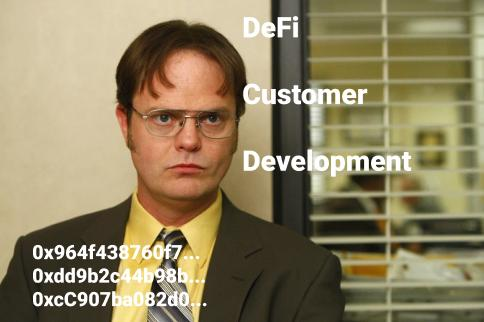

# Awesome DeFi Product Management
A curated list of decentralized finance (DeFi) product management resources 

## Table of Contents
- [Product Management in Decentralized Finance / Open Finance](#Product-Management-in-Decentralized-Finance--Open-Finance)
- [User Experience and User Research](#User-Experience-and-User-Research)
- [Analytics and Metrics](#Analytics-and-Metrics)
- [Business models and pricing](#Business-models-and-pricing)
- [Courses](#Courses)
- [Getting a job](#Getting-a-job)
- [Communities](#Communities)
- [Additional Resources](#Additional-Resources)
- [Contribute](#Contribute)

## Product Management in Decentralized Finance / Open Finance
1. [Progressive Decentralization: A Playbook for Building Crypto Applications](https://a16z.com/2020/01/09/progressive-decentralization-crypto-product-management/) by Jesse Walden
2. [Do Protocols need Product Management?](https://medium.com/swlh/do-protocols-need-product-management-6c597d65faad) by Kristen Stone
3. [The New World of Product Management: When the User is the Customer](https://medium.com/@rika.sukenik6/the-new-world-of-product-management-when-the-user-is-the-customer-c74beba7dfaf) by Rika Sukenik
4. [Applications: today & 2025](https://youtu.be/3jPYk7ucrjo) by Balaji Srinivasan

## User Experience and User Research
1. [The Next Wave of DeFi Users: A UX Research Study](https://medium.com/usegossamer/the-next-wave-of-defi-users-a-ux-research-study-f20f180c23a1) by Gossamer
2. [DeFi User Research Report by Consensys Codefi](https://pages.consensys.net/codefi-def-user-research-report) by Consensys Codefi
3. [4 Key Findings in CoinGecko's Decentralized Finance (DeFi) Survey](https://www.coingecko.com/buzz/defi-survey) by Coingecko
4. [DeFi User Survey — The results & insights](https://medium.com/dexdotblue/defi-usage-survey-the-results-insights-b3481275019b) by Argent, Kleros, Kyber Network, Maker, Ren, Synthetix, and Uniswap
5. [State of Adoption](https://www.stateofcrypto.report/) by IDEO CoLab Ventures, Decentral Park Capital, and other contributors.
6. [DeFi Usage Numbers](https://thecontrol.co/defi-usage-numbers-7e5e2cd5ab2e) by Richard Chen
7. [2020: The Borderless State of DeFi](https://research.binance.com/analysis/2020-borderless-state-of-defi) by Binance

## Analytics and Metrics
1. [Dune Analytics](https://www.duneanalytics.com/) allows you to create whatever analysis you want from smart-contracts data, build dashboard, and shate it
2. [Our Network](https://ournetwork.substack.com), the newsletter about on-chain analytics
3. [The Graph](https://thegraph.com/) allows you to easily get any public data from blockchain

## Business models and pricing
1. [The crypto price innovation cycle](https://a16z.com/2020/05/15/the-crypto-price-innovation-cycle/)
2. [Business Models in Decentralized Finance](https://medium.com/coinmonks/business-models-in-decentralized-finance-d71604476825)
3. [How Much Does A Crypto-Vote Cost?](https://www.placeholder.vc/blog/2020/1/7/how-much-does-a-crypto-vote-cost)
4. [How to value crypto capital assets](https://bankless.substack.com/p/how-to-value-crypto-capital-assets)

## Courses
1. [Crypto startup school](https://a16z.com/crypto-startup-school/)

## Getting a job
1. [DeFi jobs](https://www.defi.jobs/)
2. [Crypto PM jobs newsletter](https://blockchainpm.substack.com/)

## Communities
1. [DeFi Product Management](https://t.me/defiproduct)
2. [SF crypto product management group](https://www.eventbrite.com/e/sf-crypto-product-manager-group-good-product-management-in-turbulent-times-defi-with-swapnet-tickets-99299754238)
3. [Blockchain PM Community](https://t.me/BlockchainPMCommunity)

## Contribute
Contributions are highly welcome! PR only the resources related to product management in DeFi 

### Find a problem?
You can pull request or just leave me an issue, or just email me (vadym.n@atomica.org)

### Do you want to discuss analytics, memes, UX, and growth?
Join the [community](https://t.me/defiPM)
